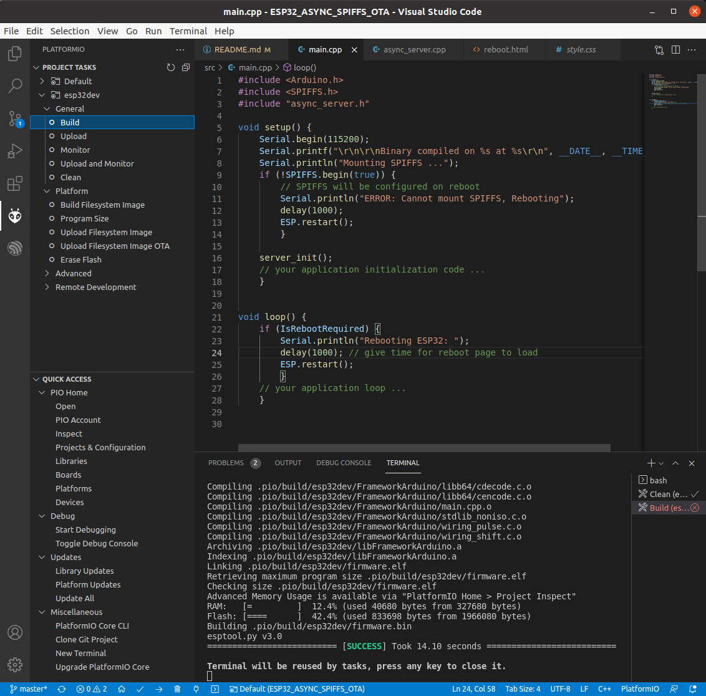

# Demonstrates use of ESP32 Async Web Server 
* Optional build configurations
	* webserver on station connecting to existing Access Point 
	* webserver on stand-alone Access Point
* Connect to 'http://esp32.local' for webpage access using ESPmDNS
* Webpage access control with user and password authentication
* SPIFFS directory access for non *.bin files
	* file list
	* upload replacement or new file
	* download existing file
	* delete existing file
* OTA firmware update. On file upload, if you select a '*.bin' file, it is not uploaded to the SPIFFS partition 
but is treated as a firmware update.
* Reboot ESP32 target
* SPIFFS hosted .html and style.css files. These can be replaced to modify webpage functionality and
look without recompiling a new binary.
* Visual Studio Code + Platformio plugin using Espressif Arduino framework
* Assumes 4MB flash, uses 'min_spiffs.csv' partitition table (larger OTA code partitions, smaller SPIFFS partition) 

## Credits

This is a mashup of functionality from the following repositories, with added OTA update feature:
* https://github.com/smford/esp32-asyncwebserver-fileupload-example
* https://randomnerdtutorials.com/esp32-web-server-spiffs-spi-flash-file-system/

## Project Notes

Visual Studio Code + Platformio plugin with Espressif Arduino framework

  

Webpage access control with user and password

  

SPIFFS directory listing

  

OTA firmware update

  

Webpage triggered rebooting

  

Logged out 

  

